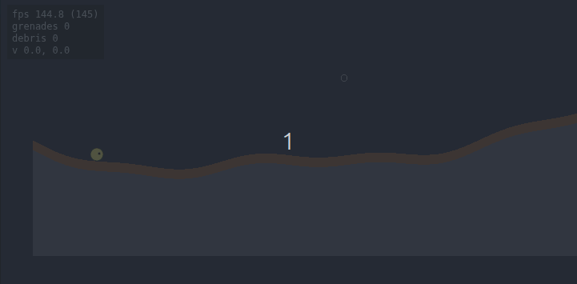

# pixel-perfect

> Pixel-perfect spatial reasoning for Phaser v4: chunked-bitmap destructible terrain, alpha-aware sprite collision, and procedural-mask utilities.



**Status:** `v3.1.5` — stable public surface; **mass-based fluid simulation** (water/oil/gas) with continuous Float32 mass per cell. Pressure emerges from the over-compression overflow rule, so surfaces actually flatten. Lateral reach spreads up to 25 cells per tick (~25× gravity, v3.1.1), with adaptive throttle to 5 above ~8 000 active cells. Vertical 1–2 cell wide fall columns are transparent to horizontal flow (v3.1.2 + narrowed criterion in v3.1.3) — water running below a cliff bypasses the falling stream while sub-surface pool cells continue to equalize normally. **Pool-based fast path (v3.1)**: above ~10 000 active cells the sim flood-fills connected components and replaces per-cell mass transfer for pool interiors with a single uniform-distribution pass — keeps the larger reach affordable on settled bodies. Sand / fire / static stay binary (v2.x rules preserved). Cross-material density swaps still atomic. Sparse active-cell tracking (v2.4) + fast-path direct array access (v3.0.3) keep step cost proportional to moving cells. Demos 03/07/09 carry annotated `@snippet` blocks rendered as ready-to-paste cards (v2.6); a top-level [recipes index](https://dzyamik.github.io/pixel-perfect/recipes/) aggregates them. Local development only (not on npm yet).

## What this is

A library for Phaser v4 games that need pixel-accurate world manipulation:

- Destructible terrain with proper Box2D colliders that follow the bitmap.
- Alpha-aware sprite-vs-sprite and sprite-vs-terrain collision.
- Procedural terrain generation from PNG masks.
- Spatial queries (raycast, surface-find, material sampling) directly on the bitmap.

The bitmap is the source of truth — all visuals and physics colliders are derived from it. Mutate the bitmap; everything else updates automatically at end-of-frame.

## Why

Phaser v4 + Phaser Box2D are both production-ready, but no maintained library exists for pixel-perfect spatial reasoning on this stack. This fills the gap.

## Live demos

The `examples/` folder is built into `docs/` and committed; run them locally with `npm run dev`, or browse the deployed copies at https://dzyamik.github.io/pixel-perfect/. Every demo's nav has a "view source" link straight to its `main.ts`.

| Demo | What it shows |
|---|---|
| 01 — basic rendering | TerrainRenderer painting a procedural bitmap |
| 02 — click to carve | input + carve + per-chunk repaint |
| 03 — physics colliders | Box2D world, drop balls, debug overlay |
| 04 — falling debris | DebrisDetector + dynamic bodies, L-shaped pieces falling |
| 05 — pixel-perfect sprite | drag a circle onto a ring + terrain; bbox vs pixel-perfect |
| 06 — worms-style | walking circle + grenades that carve and detach cliff slabs |
| 07 — image-based terrain | stamp a PNG / canvas alpha mask onto the bitmap, then carve |
| 08 — sprite playground | upload your own PNG; cyan outline traces the alpha mask |
| 09 — falling sand sandbox | five fluid kinds (sand / water / oil / gas / fire) + flammable wood + ball drop |

## Quickstart

```ts
import * as Phaser from 'phaser';
import { PixelPerfectPlugin } from 'pixel-perfect';

class GameScene extends Phaser.Scene {
    create() {
        const terrain = this.pixelPerfect.terrain({
            width: 512,
            height: 256,
            chunkSize: 64,
            x: 64,
            y: 32,
            materials: [
                {
                    id: 1,
                    name: 'dirt',
                    color: 0x8b5a3c,
                    density: 1,
                    friction: 0.7,
                    restitution: 0.1,
                    destructible: true,
                    destructionResistance: 0,
                },
            ],
            // worldId: yourBox2DWorld, // optional — physics integration
        });

        // Carve / deposit at any time. End-of-frame, the plugin
        // flushes pending physics rebuilds and repaints dirty chunks.
        this.input.on('pointerdown', (p: Phaser.Input.Pointer) => {
            terrain.carve.circle(p.worldX, p.worldY, 16);
        });
    }
}

new Phaser.Game({
    type: Phaser.AUTO,
    width: 640,
    height: 360,
    scene: GameScene,
    plugins: {
        scene: [
            {
                key: 'PixelPerfectPlugin',
                plugin: PixelPerfectPlugin,
                mapping: 'pixelPerfect',
            },
        ],
    },
});
```

For physics integration (debris, falling chunks, sprite collision), see the demos under `examples/03-physics/` and `examples/04-falling-debris/`.

## API reference

Generated by TypeDoc from the `src/` TSDoc comments. Built locally
via `npm run build` into `docs/api/` and deployed alongside the demos
at https://dzyamik.github.io/pixel-perfect/api/.

## Roadmap

See [`docs-dev/02-roadmap.md`](docs-dev/02-roadmap.md). Current state of in-flight work and known limitations live in [`docs-dev/PROGRESS.md`](docs-dev/PROGRESS.md).

## Architecture

See [`docs-dev/01-architecture.md`](docs-dev/01-architecture.md). Three layers, depend downward only:

- `src/phaser/` — plugin and GameObjects.
- `src/physics/` — Box2D adapter.
- `src/core/` — pure TypeScript, zero runtime deps.

## Contributing

Patches and bug reports welcome. See
[`CONTRIBUTING.md`](CONTRIBUTING.md) for the dev workflow and
[`.github/ISSUE_TEMPLATE/`](.github/ISSUE_TEMPLATE/) for bug / feature
templates. Project conduct: [`CODE_OF_CONDUCT.md`](CODE_OF_CONDUCT.md).

## License

MIT.
